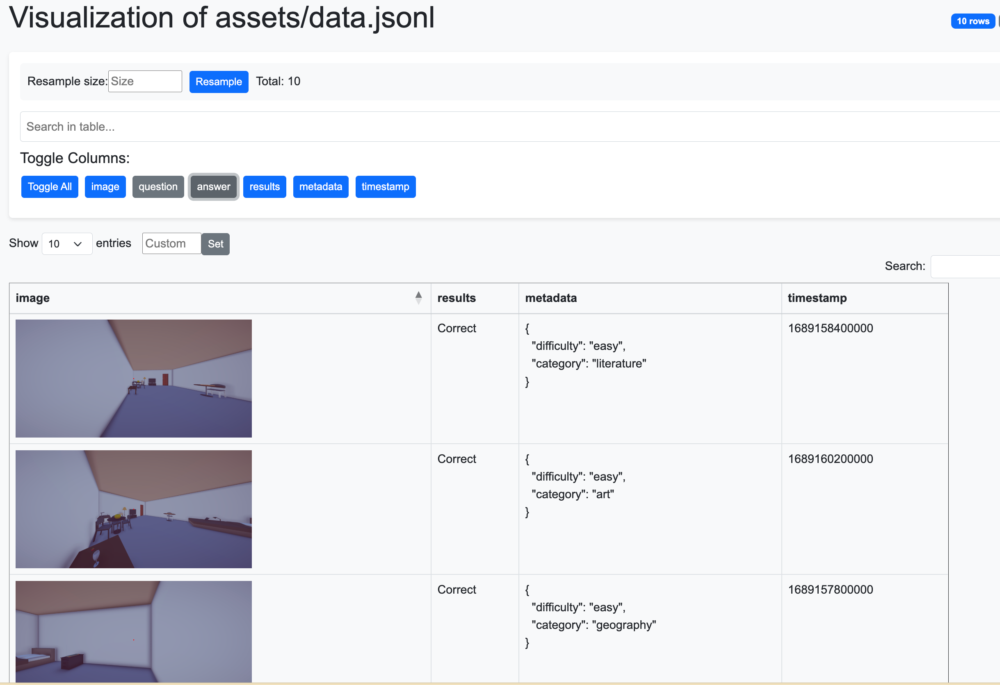
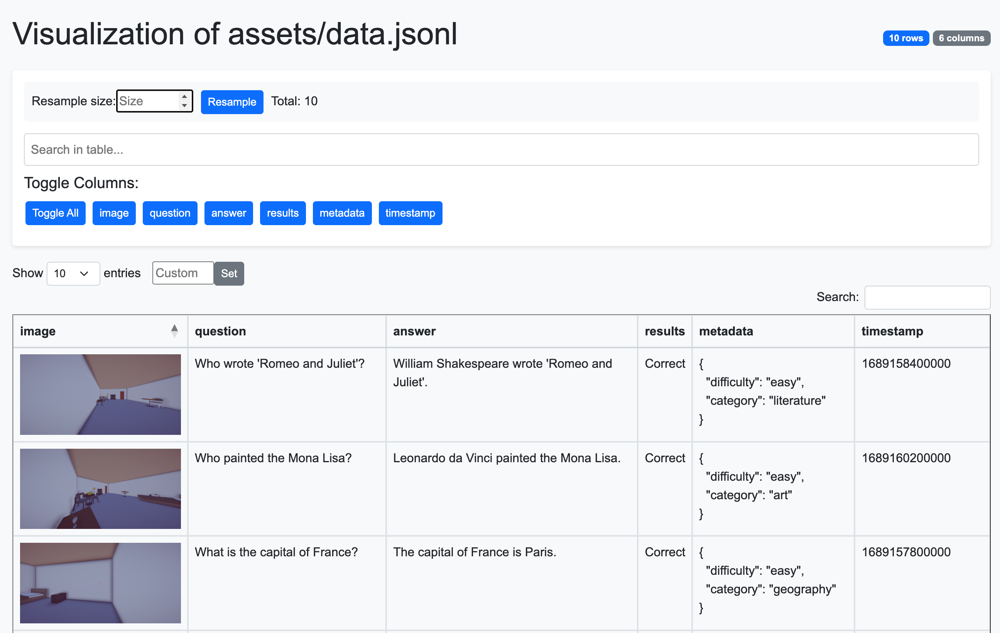
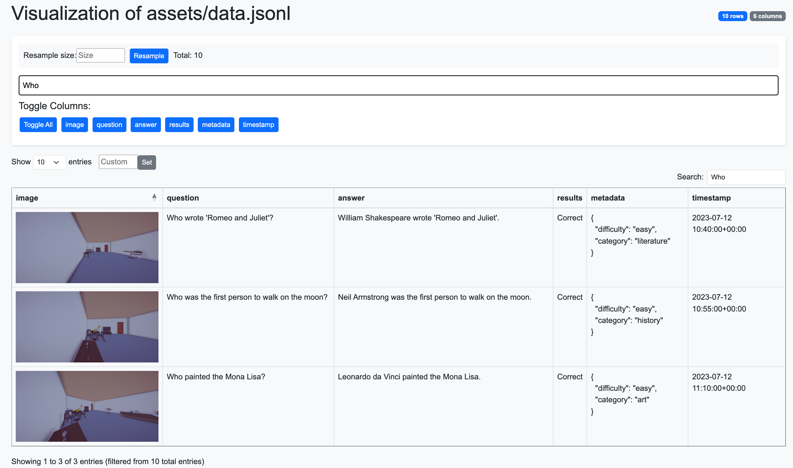
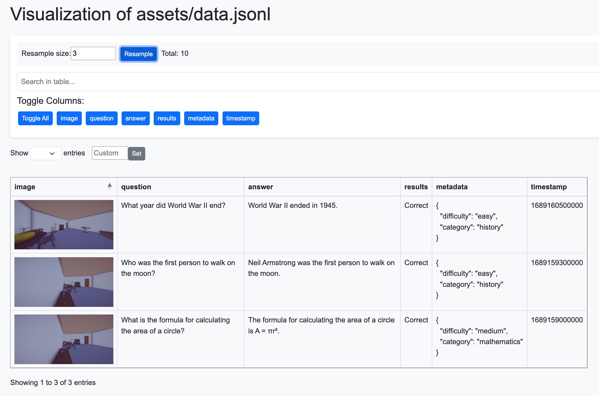
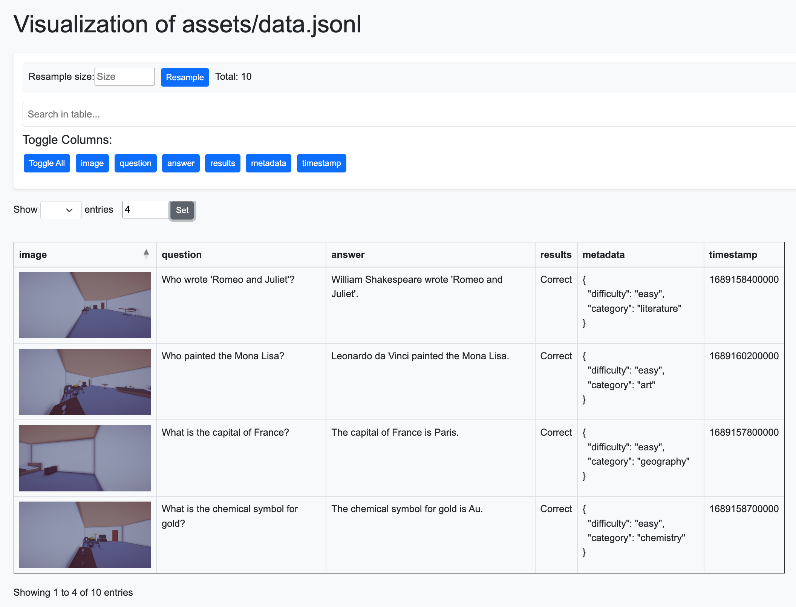

# 🌟 JSON Visualizer

A powerful tool for visualizing JSON and JSONL files as interactive HTML tables with advanced features.

## 🚀 Installation

```bash
git clone https://github.com/linjh1118/json_viz.git
cd json_viz
pip install -r requirements.txt
```

## 📚 Features

- 🔍 Visualize JSON/JSONL files as interactive HTML tables
- 🎯 Dynamic column visibility toggling
- 🔄 Interactive data sampling and resampling in the browser
- 🔎 Full-text searching in table data
- 📊 Pagination and sorting for better data exploration
- 🖼️ Automatic handling of image paths/URLs
- 📝 Text formatting for better readability
- 📦 Automatic processing of nested JSON objects and arrays

## 🎮 Usage

### 🔧 Basic Usage

```python
from json_viz import JsonVisualizer

# Basic visualization
JsonVisualizer.visualize("assets/data.jsonl", "assets/data.html")
```

### ⚙️ Advanced Options

```python
from json_viz import JsonVisualizer

# With more options
JsonVisualizer.visualize(
    input_file="assets/data.jsonl",
    output_file="assets/data.html",
    sample_size=100,  # Randomly sample 100 rows
    textual_cols=["question", "answer", "results"],  # Columns with text content
    merge_cols=["image", "caption"],  # Columns to merge
    drop_cols=["metadata", "timestamp"],  # Columns to exclude
    title="My Dataset Visualization"  # Custom title
)
```

### 🖥️ Command Line Usage

```bash
# Basic usage
python -m json_viz assets/data.jsonl

# With more options (not recommanded, cause you can sample or taggle col in html aboved)
python -m json_viz assets/data.jsonl --output data.html --sample 100 --textual-cols question answer --merge-cols image caption --drop-cols metadata timestamp --title "Dataset Visualization"
```

## 🌐 Interactive Web Interface

The generated HTML visualization provides a rich interactive interface:

### 📊 Column Toggling
Toggle specific columns on/off to focus on the data that matters most. Hide irrelevant columns to simplify your view.

<table>
  <tr>
    <td></td>
    <td></td>
  </tr>
  <tr>
    <td align="center">Column Toggle</td>
    <td align="center">View of All Column</td>
  </tr>
</table>

### 🔎 Full-Text Search
Instantly search across all content with the powerful search function to quickly find specific information.



### 🔄 Dynamic Resampling
Sample different subsets of your data directly in the browser - no need to regenerate the HTML file.



### 📋 Data Pagination
View your data in manageable chunks with pagination controls, or limit view to a specific number of records.



## 📝 Example Data Format

The library works with any valid JSON or JSONL file. Here's an example of a JSONL format:

```json
{"image": "/workspace/linjh/CoT_Factory/json_viz/assets/linjh_phy.jpeg", "question": "What is the capital of France?", "answer": "The capital of France is Paris.", "results": "Correct", "metadata": {"difficulty": "easy", "category": "geography"}, "timestamp": "2023-07-12T10:30:00Z"}
{"image": "/workspace/linjh/CoT_Factory/json_viz/assets/linjh_phy.jpeg", "question": "How many planets are in our solar system?", "answer": "There are 8 planets in our solar system: Mercury, Venus, Earth, Mars, Jupiter, Saturn, Uranus, and Neptune.", "results": "Correct", "metadata": {"difficulty": "medium", "category": "astronomy"}, "timestamp": "2023-07-12T10:35:00Z"}
```

## 🔮 Custom Processing

- 📔 Dictionary fields are automatically converted to formatted JSON strings
- 🖼️ Image URLs are automatically detected and displayed inline
- 📊 Text formatting applied to make content more readable

## 🛠️ Requirements

- Python 3.6+
- pandas
- Pillow
- requests

## 📋 License

MIT License

## 🤝 Contributing
Contributions are welcome! Feel free to open an issue or submit a pull request.